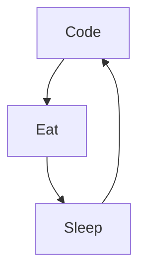

# Mike Codeur
I'm Mike from France, living in Bali 🌴, FullStack developper and Mentor/Teacher, I do content on Development and Freelancing. I really enjoy learning languages and frameworks like JS and React. 

<!--
**MikeCodeur/MikeCodeur** is a ✨ _special_ ✨ repository because its `README.md` (this file) appears on your GitHub profile.
-->
Actually:

- 🔭 I’m currently working on a new [Online Course][courses] ...
- 🌱 I’m currently learning amazing things ...
- 👯 I help people to be programmers and freelancers ...
- ⚡ Fun fact : I'am DJ, Diver, Skateboarder and Surfer
- 📫 How to reach me: Instagram or email

## My 100% online React Bootcamp

 <strong>
    3 months to be a really good Full Stack Programmer
  </strong>
  

    Be a Master in React/ Next by building amazing projects
  

  
 
  

### Connect with me:

&nbsp;&nbsp;

&nbsp;&nbsp;

&nbsp;&nbsp;

&nbsp;&nbsp;

### Languages and Tools:

[][youtubeplaylist]

[][youtubeplaylist]
[][youtubeplaylist]
[][youtubeplaylist]
[][youtubeplaylist]
[][youtubeplaylist]
[][youtubeplaylist]
[][youtubeplaylist]
[][youtubeplaylist]
[][youtubeplaylist]

[][youtubeplaylist]

 
 

### My daily routine :

### 🔥 Recent GitHub Activity
<!--START_SECTION:activity-->
1. ❗ Opened issue [#3236](https://github.com/better-auth/better-auth/issues/3236) in [better-auth/better-auth](https://github.com/better-auth/better-auth)
2. ❗ Opened issue [#3235](https://github.com/better-auth/better-auth/issues/3235) in [better-auth/better-auth](https://github.com/better-auth/better-auth)
3. 🗣 Commented on [#3189](https://github.com/better-auth/better-auth/issues/3189#issuecomment-3022389779) in [better-auth/better-auth](https://github.com/better-auth/better-auth)
4. ❗ Opened issue [#3233](https://github.com/better-auth/better-auth/issues/3233) in [better-auth/better-auth](https://github.com/better-auth/better-auth)
5. 🗣 Commented on [#1](https://github.com/MikeCodeur/typescript-expert/issues/1#issuecomment-2219188953) in [MikeCodeur/typescript-expert](https://github.com/MikeCodeur/typescript-expert)
<!--END_SECTION:activity-->

### ⭐ GitHub Stats

### 📺 Last Youtube:

<!-- YOUTUBE:START -->
- [Je lance un Boilerplate IA &lpar;créer ton SaaS en quelques semaines&rpar;](https://www.youtube.com/watch?v=VfMFlIRrRso)
- [Les problèmes Business d’un SaaS](https://www.youtube.com/shorts/xbm2XHlV5Ck)
- [Je prépare un nouveau projet… &lpar;et ça sort bientôt&rpar;](https://www.youtube.com/watch?v=t0lYiDnBRfc)
- [Les problèmes Techniques d’un SaaS](https://www.youtube.com/shorts/6dA8uPW6kIY)
- [Mes 3 stratégies SaaS pour atteindre 10K MRR &lpar;sans perdre de temps&rpar;](https://www.youtube.com/watch?v=xrV71aBxj2s)
<!-- YOUTUBE:END -->

  
📒 Latest blog content

<!-- BLOG-POST-LIST:START -->
- [Les problèmes Opérationnels d’un SaaS](https://www.mikecodeur.com/2025/10/10/les-problemes-operationnels-dun-saas/)
- [Je lance un Boilerplate IA &lpar;créer ton SaaS en quelques semaines&rpar;](https://www.mikecodeur.com/2025/10/08/je-lance-un-boilerplate-ia-creer-ton-saas-en-quelques-semaines/)
- [Les problèmes Business d’un SaaS](https://www.mikecodeur.com/2025/10/06/les-problemes-business-dun-saas/)
- [Je prépare un nouveau projet… &lpar;et ça sort bientôt&rpar;](https://www.mikecodeur.com/2025/10/04/je-prepare-un-nouveau-projet-et-ca-sort-bientot/)
- [Les problèmes Techniques d’un SaaS](https://www.mikecodeur.com/2025/10/03/les-problemes-techniques-dun-saas/)
<!-- BLOG-POST-LIST:END -->

[courses]: https://go.mikecodeur.com/next-mastery
[website]: https://go.mikecodeur.com/blog
[insta]: https://go.mikecodeur.com/instagram
[Youtube]: https://go.mikecodeur.com/youtube
[youtubeplaylist]: https://www.youtube.com/channel/UC7BNBNLwMF8GjgXLDP8PWQw
