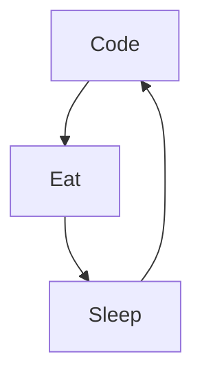

# Mike Codeur
I'm Mike from France, living in Bali 🌴, FullStack developper and Mentor/Teacher, I do content on Development and Freelancing. I really enjoy learning languages and frameworks like JS and React. 

<!--
**MikeCodeur/MikeCodeur** is a ✨ _special_ ✨ repository because its `README.md` (this file) appears on your GitHub profile.
-->
Actually:

- 🔭 I’m currently working on a new [Online Course][courses] ...
- 🌱 I’m currently learning amazing things ...
- 👯 I help people to be programmers and freelancers ...
- ⚡ Fun fact : I'am DJ, Diver, Skateboarder and Surfer
- 📫 How to reach me: Instagram or email

## My 100% online React Bootcamp

 <strong>
    3 months to be a really good Full Stack Programmer
  </strong>
  

    Be a Master in React/ Next by building amazing projects
  

  
 
  

### Connect with me:

&nbsp;&nbsp;

&nbsp;&nbsp;

&nbsp;&nbsp;

&nbsp;&nbsp;

### Languages and Tools:

[][youtubeplaylist]

[][youtubeplaylist]
[][youtubeplaylist]
[][youtubeplaylist]
[][youtubeplaylist]
[][youtubeplaylist]
[][youtubeplaylist]
[][youtubeplaylist]
[][youtubeplaylist]
[][youtubeplaylist]

[][youtubeplaylist]

 
 

### My daily routine :

### 🔥 Recent GitHub Activity
<!--START_SECTION:activity-->
1. ❗ Opened issue [#7](https://github.com/MikeCodeur/react-patterns/issues/7) in [MikeCodeur/react-patterns](https://github.com/MikeCodeur/react-patterns)
2. ❗ Opened issue [#18](https://github.com/MikeCodeur/react-prerequis-debutants/issues/18) in [MikeCodeur/react-prerequis-debutants](https://github.com/MikeCodeur/react-prerequis-debutants)
3. 🗣 Commented on [#2](https://github.com/MikeCodeur/typescript-expert/issues/2#issuecomment-2224266212) in [MikeCodeur/typescript-expert](https://github.com/MikeCodeur/typescript-expert)
4. 🗣 Commented on [#8](https://github.com/MikeCodeur/react-testing/issues/8#issuecomment-2219232858) in [MikeCodeur/react-testing](https://github.com/MikeCodeur/react-testing)
5. 🗣 Commented on [#1](https://github.com/MikeCodeur/typescript-expert/issues/1#issuecomment-2219188953) in [MikeCodeur/typescript-expert](https://github.com/MikeCodeur/typescript-expert)
<!--END_SECTION:activity-->

### ⭐ GitHub Stats

### 📺 Last Youtube:

<!-- YOUTUBE:START -->
- [La seule Formation Next 15 React 19 Fullstack du marché ! #codeur](https://www.youtube.com/watch?v=8lQ1aG3seEQ)
- [Développement Fullstack avec React + FireBase](https://www.youtube.com/watch?v=Euab2RzT1C0)
- [5 Idées de Projets FULLSTACK avec NEXT.JS](https://www.youtube.com/watch?v=Kjr4rhGVr2w)
- [Les Prérequis de Next.js FullStack](https://www.youtube.com/watch?v=CiRP0XH3PNk)
- [Next.js FullStack : Les Prérequis Indispensables pour bien Démarrer et Réussir](https://www.youtube.com/watch?v=Xdf65CF4YP0)
<!-- YOUTUBE:END -->

  
📒 Latest blog content

<!-- BLOG-POST-LIST:START -->
- [La seule formation Next 15 React 19 Fullstack du marché ! #codeur](https://www.mikecodeur.com/2024/11/06/la-seule-formation-next-15-react-19-fullstack-du-marche-codeur/)
- [Développement Fullstack avec React + FireBase](https://www.mikecodeur.com/2024/11/04/developpement-fullstack-avec-react-firebase/)
- [5 Idées de Projets FULLSTACK avec NEXT.JS](https://www.mikecodeur.com/2024/10/31/5-idees-de-projets-fullstack-avec-next-js/)
- [Les Prérequis de Next.js FullStack](https://www.mikecodeur.com/2024/10/29/les-prerequis-de-next-js-fullstack/)
- [Next.js FullStack : Les Prérequis Indispensables pour bien Démarrer et Réussir](https://www.mikecodeur.com/2024/10/24/next-js-fullstack-les-prerequis-indispensables-pour-bien-demarrer-et-reussir/)
<!-- BLOG-POST-LIST:END -->

[courses]: https://go.mikecodeur.com/next-mastery
[website]: https://go.mikecodeur.com/blog
[insta]: https://go.mikecodeur.com/instagram
[Youtube]: https://go.mikecodeur.com/youtube
[youtubeplaylist]: https://www.youtube.com/channel/UC7BNBNLwMF8GjgXLDP8PWQw
