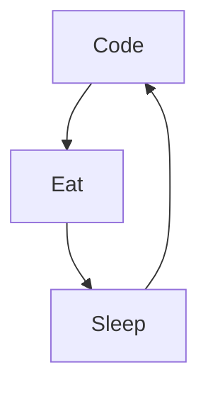

# Mike Codeur
I'm Mike from France, living in Bali 🌴, FullStack developper and Mentor/Teacher, I do content on Development and Freelancing. I really enjoy learning languages and frameworks like JS and React. 

<!--
**MikeCodeur/MikeCodeur** is a ✨ _special_ ✨ repository because its `README.md` (this file) appears on your GitHub profile.
-->
Actually:

- 🔭 I’m currently working on a new [Online Course][courses] ...
- 🌱 I’m currently learning amazing things ...
- 👯 I help people to be programmers and freelancers ...
- ⚡ Fun fact : I'am DJ, Diver, Skateboarder and Surfer
- 📫 How to reach me: Instagram or email

## My 100% online React Bootcamp

 <strong>
    3 months to be a really good React Programmer
  </strong>
  

    Be a Master in React by building amazing projects
  

  
 
  

### Connect with me:

&nbsp;&nbsp;

&nbsp;&nbsp;

&nbsp;&nbsp;

&nbsp;&nbsp;

### Languages and Tools:

[][youtubeplaylist]

[][youtubeplaylist]
[][youtubeplaylist]
[][youtubeplaylist]
[][youtubeplaylist]
[][youtubeplaylist]
[][youtubeplaylist]
[][youtubeplaylist]
[][youtubeplaylist]
[][youtubeplaylist]

[][youtubeplaylist]

 
 

### My daily routine :

### 🔥 Recent GitHub Activity
<!--START_SECTION:activity-->
1. 🗣 Commented on [#7](https://github.com/MikeCodeur/react-testing/issues/7#issuecomment-1592606655) in [MikeCodeur/react-testing](https://github.com/MikeCodeur/react-testing)
2. 🗣 Commented on [#7](https://github.com/MikeCodeur/react-testing/issues/7#issuecomment-1592588041) in [MikeCodeur/react-testing](https://github.com/MikeCodeur/react-testing)
3. 🗣 Commented on [#7](https://github.com/MikeCodeur/react-testing/issues/7#issuecomment-1592567059) in [MikeCodeur/react-testing](https://github.com/MikeCodeur/react-testing)
4. 🗣 Commented on [#6](https://github.com/MikeCodeur/react-testing/issues/6) in [MikeCodeur/react-testing](https://github.com/MikeCodeur/react-testing)
5. 🗣 Commented on [#11](https://github.com/MikeCodeur/react-tracker-app/issues/11) in [MikeCodeur/react-tracker-app](https://github.com/MikeCodeur/react-tracker-app)
<!--END_SECTION:activity-->

### ⭐ GitHub Stats

### 📺 Last Youtube:

<!-- YOUTUBE:START -->
- [C&#39;EST DE PLUS EN PLUS DUR ! FAQ : &lpar;CHILL AND QNA EP.5&rpar;](https://www.youtube.com/watch?v=4DpWb7eJHC8)
- [YOUTUBE : RAT RACE,  POURQUOI J&#39;AI ARRETÉ DE FAIRE DES VIDÉOS ?](https://www.youtube.com/watch?v=Sam0Cy-SIsU)
- [DE DÉVELOPPEUR À INVESTISSEUR IMMOBILIER - &lpar;VLOG - BALI, TULUM, COLOMBIE, NEW YORK&rpar;](https://www.youtube.com/watch?v=gJmzIpB7itQ)
- [VISITE DE MA VILLA À BALI - &lpar;Comment construire à Bali ?&rpar;](https://www.youtube.com/watch?v=WuPF71OqEBU)
- [Si tu ne fais pas de tests unitaires, tu es un développeurs du dimanche](https://www.youtube.com/watch?v=ZSrqjgGnPHE)
<!-- YOUTUBE:END -->

  
📒 Latest blog content

<!-- BLOG-POST-LIST:START -->
- [SSII Viandards ?](https://www.mikecodeur.com/2023/12/13/ssii-viandards/)
- [Ca ne passera plus](https://www.mikecodeur.com/2023/12/12/ca-ne-passera-plus/)
- [C’EST DE PLUS EN PLUS DUR !  &lpar;CHILL AND QNA EP.5&rpar;](https://www.mikecodeur.com/2023/12/10/cest-de-plus-en-plus-dur-chill-and-qna-ep-5/)
- [Se remettre à niveau sur un Framework](https://www.mikecodeur.com/2023/12/09/se-remettre-a-niveau-sur-un-framework/)
- [290€ de TJM](https://www.mikecodeur.com/2023/12/08/290e-de-tjm/)
<!-- BLOG-POST-LIST:END -->

[courses]: https://formations.mikecodeur.com
[website]: https://go.mikecodeur.com/blog
[insta]: https://go.mikecodeur.com/instagram
[Youtube]: https://go.mikecodeur.com/youtube
[youtubeplaylist]: https://www.youtube.com/channel/UC7BNBNLwMF8GjgXLDP8PWQw
