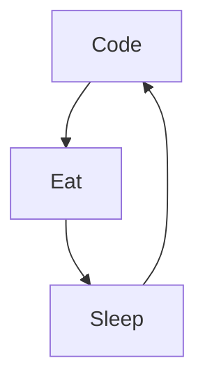

# Mike Codeur
I'm Mike from France, living in Bali 🌴, FullStack developper and Mentor/Teacher, I do content on Development and Freelancing. I really enjoy learning languages and frameworks like JS and React. 

<!--
**MikeCodeur/MikeCodeur** is a ✨ _special_ ✨ repository because its `README.md` (this file) appears on your GitHub profile.
-->
Actually:

- 🔭 I’m currently working on a new [Online Course][courses] ...
- 🌱 I’m currently learning amazing things ...
- 👯 I help people to be programmers and feelancers ...
- ⚡ Fun fact : I'am DJ, Diver, Skateboarder and Surfer
- 📫 How to reach me: Instagram or email

## My 100% online React Bootcamp

 <strong>
    3 months to be a really good React Programmer
  </strong>
  

    Be a Master in React by building amazing projects
  

  
 
  

### Connect with me:

&nbsp;&nbsp;

&nbsp;&nbsp;

&nbsp;&nbsp;

&nbsp;&nbsp;

### Languages and Tools:

[][youtubeplaylist]

[][youtubeplaylist]
[][youtubeplaylist]
[][youtubeplaylist]
[][youtubeplaylist]
[][youtubeplaylist]
[][youtubeplaylist]
[][youtubeplaylist]
[][youtubeplaylist]
[][youtubeplaylist]

[][youtubeplaylist]

 
 

### My daily routine :

### 🔥 Recent GitHub Activity
<!--START_SECTION:activity-->
1. 🗣 Commented on [#26](https://github.com/mustaphaturhan/chakra-ui-markdown-renderer/issues/26) in [mustaphaturhan/chakra-ui-markdown-renderer](https://github.com/mustaphaturhan/chakra-ui-markdown-renderer)
2. 🗣 Commented on [#26](https://github.com/mustaphaturhan/chakra-ui-markdown-renderer/issues/26) in [mustaphaturhan/chakra-ui-markdown-renderer](https://github.com/mustaphaturhan/chakra-ui-markdown-renderer)
3. ❗️ Opened issue [#26](https://github.com/mustaphaturhan/chakra-ui-markdown-renderer/issues/26) in [mustaphaturhan/chakra-ui-markdown-renderer](https://github.com/mustaphaturhan/chakra-ui-markdown-renderer)
4. 💪 Opened PR [#1](https://github.com/MikeCodeur/react-netflix-clone/pull/1) in [MikeCodeur/react-netflix-clone](https://github.com/MikeCodeur/react-netflix-clone)
5. 🎉 Merged PR [#9](https://github.com/MikeCodeur/react-hooks-avances/pull/9) in [MikeCodeur/react-hooks-avances](https://github.com/MikeCodeur/react-hooks-avances)
<!--END_SECTION:activity-->

### ⭐ GitHub Stats

### 📺 Last Youtube:

<!-- YOUTUBE:START -->
- [5 extensions Vscode à installer absolument si tu es dev front ! ☝️🔥](https://www.youtube.com/watch?v=MoulRNds4PM)
- [Les deux grandes manières de facturer un client quand tu es développeur freelance  ? ☝️🔥](https://www.youtube.com/watch?v=WNm1pFWypZ8)
- [J&#39;ANALYSE 4 PROJETS DEV FRONT REACT JS](https://www.youtube.com/watch?v=7jMmCcRFXAI)
- [DE DIRECTEUR DES VENTES À DEV FRONT END REACT À 43 ANS - INTERVIEW](https://www.youtube.com/watch?v=0JpsCB5WTJo)
- [DEVENIR DEV FRONT REACT EN PARALLÈLE DE SES ÉTUDES - INTERVIEW AXEL](https://www.youtube.com/watch?v=Gxjdk2Xk_qQ)
<!-- YOUTUBE:END -->

  
📒 Latest blog content

<!-- BLOG-POST-LIST:START -->
- [5 extensions chrome à installer absolument si tu es dev front ! ☝️🔥](https://www.mikecodeur.com/2022/07/06/5-extensions-chrome-a-installer-absolument-si-tu-es-dev-front-%e2%98%9d%ef%b8%8f%f0%9f%94%a5/)
- [Les deux grandes manières de facturer un client quand tu es développeur freelance  ? ☝️🔥](https://www.mikecodeur.com/2022/07/04/les-deux-grandes-manieres-de-facturer-un-client-quand-tu-es-developpeur-freelance-%e2%98%9d%ef%b8%8f%f0%9f%94%a5/)
- [J’ANALYSE 4 PROJETS DEV FRONT REACT JS](https://www.mikecodeur.com/2022/06/09/janalyse-4-projets-dev-front-react-js/)
- [DE DIRECTEUR DES VENTES À DEV FRONT END REACT À 43 ANS – INTERVIEW](https://www.mikecodeur.com/2022/06/06/de-directeur-des-ventes-a-dev-front-end-react-a-43-ans-interview/)
- [DEVENIR DEV FRONT REACT EN PARALLÈLE DE SES ÉTUDES – INTERVIEW AXEL](https://www.mikecodeur.com/2022/06/04/devenir-dev-front-react-en-parallele-de-ses-etudes-interview-axel/)
<!-- BLOG-POST-LIST:END -->

[courses]: https://formations.mikecodeur.com
[website]: https://go.mikecodeur.com/blog
[insta]: https://go.mikecodeur.com/instagram
[Youtube]: https://go.mikecodeur.com/youtube
[youtubeplaylist]: https://www.youtube.com/channel/UC7BNBNLwMF8GjgXLDP8PWQw