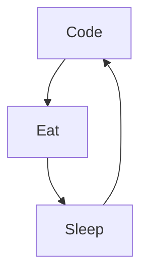

# Mike Codeur
I'm Mike from France, living in Bali 🌴, FullStack developper and Mentor/Teacher, I do content on Development and Freelancing. I really enjoy learning languages and frameworks like JS and React. 

<!--
**MikeCodeur/MikeCodeur** is a ✨ _special_ ✨ repository because its `README.md` (this file) appears on your GitHub profile.
-->
Actually:

- 🔭 I’m currently working on a new [Online Course][courses] ...
- 🌱 I’m currently learning amazing things ...
- 👯 I help people to be programmers and freelancers ...
- ⚡ Fun fact : I'am DJ, Diver, Skateboarder and Surfer
- 📫 How to reach me: Instagram or email

## My 100% online React Bootcamp

 <strong>
    3 months to be a really good React Programmer
  </strong>
  

    Be a Master in React by building amazing projects
  

  
 
  

### Connect with me:

&nbsp;&nbsp;

&nbsp;&nbsp;

&nbsp;&nbsp;

&nbsp;&nbsp;

### Languages and Tools:

[][youtubeplaylist]

[][youtubeplaylist]
[][youtubeplaylist]
[][youtubeplaylist]
[][youtubeplaylist]
[][youtubeplaylist]
[][youtubeplaylist]
[][youtubeplaylist]
[][youtubeplaylist]
[][youtubeplaylist]

[][youtubeplaylist]

 
 

### My daily routine :

### 🔥 Recent GitHub Activity
<!--START_SECTION:activity-->
1. 🗣 Commented on [#15](https://github.com/MikeCodeur/react-prerequis-debutants/issues/15) in [MikeCodeur/react-prerequis-debutants](https://github.com/MikeCodeur/react-prerequis-debutants)
2. 🗣 Commented on [#13](https://github.com/MikeCodeur/react-prerequis-debutants/issues/13) in [MikeCodeur/react-prerequis-debutants](https://github.com/MikeCodeur/react-prerequis-debutants)
3. 🗣 Commented on [#13](https://github.com/MikeCodeur/react-prerequis-debutants/issues/13) in [MikeCodeur/react-prerequis-debutants](https://github.com/MikeCodeur/react-prerequis-debutants)
4. ❗️ Closed issue [#11](https://github.com/MikeCodeur/react-tracker-app/issues/11) in [MikeCodeur/react-tracker-app](https://github.com/MikeCodeur/react-tracker-app)
5. 🗣 Commented on [#11](https://github.com/MikeCodeur/react-tracker-app/issues/11) in [MikeCodeur/react-tracker-app](https://github.com/MikeCodeur/react-tracker-app)
<!--END_SECTION:activity-->

### ⭐ GitHub Stats

### 📺 Last Youtube:

<!-- YOUTUBE:START -->
- [ChatGPT DEVIENT MON SECOND CERVEAU - EXEMPLES CONCRETS DEVELOPPEURS](https://www.youtube.com/watch?v=2BatdgK249c)
- [Chat GPT EST STUPIDE ❌ LES DÉVELOPPEURS NE DOIVENT PAS L&#39;UTILISER ?](https://www.youtube.com/watch?v=B0FEi8yxF3U)
- [FAUT-IL APPRENDRE JAVASCRIPT EN 2023 ? DRAMA ?](https://www.youtube.com/watch?v=CGvTpoJhnio)
- [ChatGPT va tuer les développeurs ☠️ ?](https://www.youtube.com/watch?v=A1La-ao2sHQ)
- [TypeScript Dev VS JavaScript Dev : en entretien 😂 #code #dev #typescript #javascript](https://www.youtube.com/watch?v=SRx-SF4wiGA)
<!-- YOUTUBE:END -->

  
📒 Latest blog content

<!-- BLOG-POST-LIST:START -->
- [QUELLE FORMATION REACT CHOISIR ? &lpar;BOOTCAMP vs FORMATION EN LIGNE vs PRESENTIEL&rpar;](https://www.mikecodeur.com/2023/02/09/quelle-formation-react-choisir-bootcamp-vs-formation-en-ligne-vs-presentiel/)
- [DÉVELOPPEUR REACT ET ÉTUDIANT](https://www.mikecodeur.com/2023/02/06/developpeur-react-et-etudiant/)
- [ChatGPT DEVIENT MON SECOND CERVEAU – EXEMPLES CONCRETS DEVELOPPEURS](https://www.mikecodeur.com/2023/02/03/chatgpt-devient-mon-second-cerveau-exemples-concrets-developpeurs/)
- [DE DIRECTEUR À DÉVELOPPEUR REACT](https://www.mikecodeur.com/2023/01/30/de-directeur-a-developpeur-react/)
- [Chat GPT EST STUPIDE ❌ LES DÉVELOPPEURS NE DOIVENT PAS L’UTILISER ?](https://www.mikecodeur.com/2023/01/27/chat-gpt-est-stupide-%e2%9d%8c-les-developpeurs-ne-doivent-pas-lutiliser/)
<!-- BLOG-POST-LIST:END -->

[courses]: https://formations.mikecodeur.com
[website]: https://go.mikecodeur.com/blog
[insta]: https://go.mikecodeur.com/instagram
[Youtube]: https://go.mikecodeur.com/youtube
[youtubeplaylist]: https://www.youtube.com/channel/UC7BNBNLwMF8GjgXLDP8PWQw
