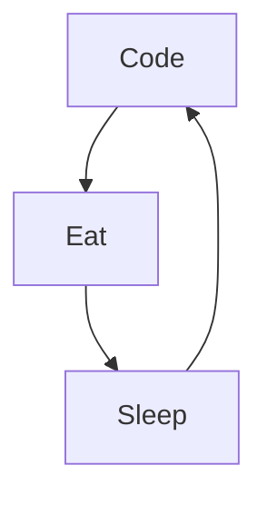

# Mike Codeur
I'm Mike from France, living in Bali 🌴, FullStack developper and Mentor/Teacher, I do content on Development and Freelancing. I really enjoy learning languages and frameworks like JS and React. 

<!--
**MikeCodeur/MikeCodeur** is a ✨ _special_ ✨ repository because its `README.md` (this file) appears on your GitHub profile.
-->
Actually:

- 🔭 I’m currently working on a new [Online Course][courses] ...
- 🌱 I’m currently learning amazing things ...
- 👯 I help people to be programmers and freelancers ...
- ⚡ Fun fact : I'am DJ, Diver, Skateboarder and Surfer
- 📫 How to reach me: Instagram or email

## My 100% online React Bootcamp

 <strong>
    3 months to be a really good Full Stack Programmer
  </strong>
  

    Be a Master in React/ Next by building amazing projects
  

  
 
  

### Connect with me:

&nbsp;&nbsp;

&nbsp;&nbsp;

&nbsp;&nbsp;

&nbsp;&nbsp;

### Languages and Tools:

[][youtubeplaylist]

[][youtubeplaylist]
[][youtubeplaylist]
[][youtubeplaylist]
[][youtubeplaylist]
[][youtubeplaylist]
[][youtubeplaylist]
[][youtubeplaylist]
[][youtubeplaylist]
[][youtubeplaylist]

[][youtubeplaylist]

 
 

### My daily routine :

```mermaid
  graph TD;
      Code-->Eat;
      Eat-->Sleep;
      Sleep-->Code;
```

### 🔥 Recent GitHub Activity
<!--START_SECTION:activity-->
1. ❗ Opened issue [#49544](https://github.com/openclaw/openclaw/issues/49544) in [openclaw/openclaw](https://github.com/openclaw/openclaw)
2. ❗ Opened issue [#3235](https://github.com/better-auth/better-auth/issues/3235) in [better-auth/better-auth](https://github.com/better-auth/better-auth)
3. 🗣 Commented on [#3189](https://github.com/better-auth/better-auth/issues/3189#issuecomment-3022389779) in [better-auth/better-auth](https://github.com/better-auth/better-auth)
4. ❗ Opened issue [#3233](https://github.com/better-auth/better-auth/issues/3233) in [better-auth/better-auth](https://github.com/better-auth/better-auth)
5. 🗣 Commented on [#1](https://github.com/MikeCodeur/typescript-expert/issues/1#issuecomment-2219188953) in [MikeCodeur/typescript-expert](https://github.com/MikeCodeur/typescript-expert)
<!--END_SECTION:activity-->

### ⭐ GitHub Stats

### 📺 Last Youtube:

<!-- YOUTUBE:START -->
- [Claude Mythos trouve des ZERO DAY que personne n&#39;avait vues en 27 ans](https://www.youtube.com/watch?v=FofhGLjXUYo)
- [Le BULLSHIT des Influenceurs IA, Mon VPS à 7€ Détruit leur Mac Mini](https://www.youtube.com/watch?v=t4P_W6K43h0)
- [Anthropic vient de tuer OpenClaw &lpar;mais il existe une solution&rpar;](https://www.youtube.com/watch?v=zr32CLqF5tM)
- [J&#39;ai trouvé 108 features cachées dans Claude Code](https://www.youtube.com/watch?v=HMx3OtNjdCI)
- [Les 6 Niveaux de Maîtrise de Claude Code](https://www.youtube.com/watch?v=Gq5VAlFfC3M)
<!-- YOUTUBE:END -->

  
📒 Latest blog content

<!-- BLOG-POST-LIST:START -->
- [La NOUVELLE feature Claude Code qui remplace une équipe entière](https://www.mikecodeur.com/2026/02/12/la-nouvelle-feature-claude-code-qui-remplace-une-equipe-entiere/)
- [Opus 4.6 est INSANE — le récap complet en 15 min](https://www.mikecodeur.com/2026/02/09/opus-4-6-est-insane-le-recap-complet-en-15-min/)
- [Mon SaaS a 510 tests, j’en ai écrit aucun &lpar;Claude Code&rpar;](https://www.mikecodeur.com/2026/02/06/mon-saas-a-510-tests-jen-ai-ecrit-aucun-claude-code/)
- [J’ai testé Codex App &lpar;la réponse à Claude Code&rpar;](https://www.mikecodeur.com/2026/02/04/jai-teste-codex-app-la-reponse-a-claude-code/)
- [OpenClaw : Le Truc le Plus FOU que J’ai Testé](https://www.mikecodeur.com/2026/02/02/openclaw-le-truc-le-plus-fou-que-jai-teste/)
<!-- BLOG-POST-LIST:END -->

[courses]: https://go.mikecodeur.com/next-mastery
[website]: https://go.mikecodeur.com/blog
[insta]: https://go.mikecodeur.com/instagram
[Youtube]: https://go.mikecodeur.com/youtube
[youtubeplaylist]: https://www.youtube.com/channel/UC7BNBNLwMF8GjgXLDP8PWQw
